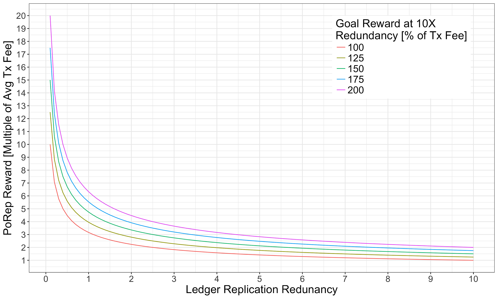

## Economic Sustainability

Long term economic sustainability is one of the guiding principles of Solana’s economic design. While it is impossible to predict how decentralized economies will develop over time, especially economies with flexible decentralized governances, we can arrange economic components such that, under certain conditions, a sustainable economy may take shape in the long term. In the case of Solana’s network, these components take the form of the remittances and deposits into and out of the reserve ‘mining pool’.

The dominant remittances from the Solana mining pool are validator and replicator rewards. The deposit mechanism is a flat, protocol-specified and adjusted, % of each transaction fee.

The Replicator rewards are to be delivered to replicators from the mining pool after successful PoRep validation. The per-PoRep reward amount is determined as a function of the total network storage redundancy at the time of the PoRep validation and the network goal redundancy. This function is likely to take the form of a discount from a base reward to be delivered when the network has achieved and maintained its goal redundancy. An example of such a reward function is shown in **Figure 3**

<!--  -->

**Figure 3**: Example PoRep reward design as a function of global network storage redundancy.

In the example shown in Figure 1, multiple per PoRep base rewards are explored (as a % of Tx Fee) to be delivered when the global ledger replication redundancy meets 10X. When the global ledger replication redundancy is less than 10X, the base reward is discounted as a function of the square of the ratio of the actual ledger replication redundancy to the goal redundancy (i.e. 10X).

The other protocol-based remittance goes to validation-clients as a reward distributed in proportion to stake-weight for voting to validate the ledger state. The functional issuance of this reward is described in [State-validation Protocol-based Rewards](ed_vce_state_validation_protocol_based_rewards.md) and is designed to reduce over time until validators are incentivized solely through collection of transaction fees. Therefore, in the long-run, protocol-based rewards to replication-nodes will be the only remittances from the mining pool, and will have to be countered by the portion of each non-PoRep transaction fee that is directed back into the mining pool. I.e. for a long-term self-sustaining economy, replicator-client rewards must be subsidized through a minimum fee on each non-PoRep transaction pre-allocated to the mining pool.  Through this constraint, we can write the following inequality:

**== WIP [here](https://docs.google.com/document/d/1HBDasdkjS4Ja9wC_tIUsZPVcxGAWTuYOq9zf6xoQNps/edit?usp=sharing) ==**
